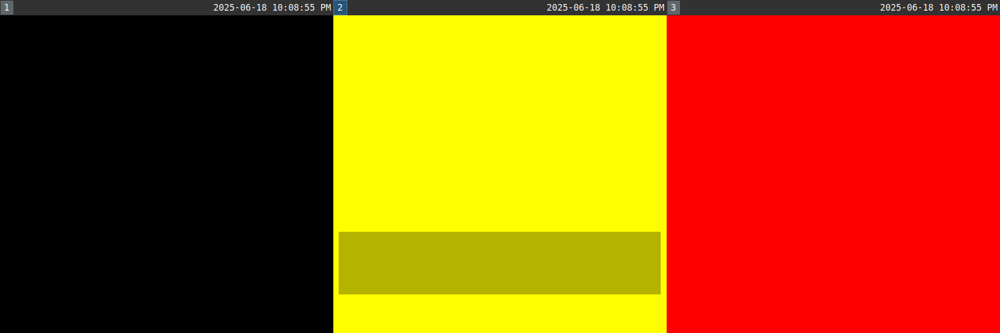

# qkdisplays - Quick Displays

qkdisplays is a helper tool for quickly configuring a multi-monitor setup,
built with tiled window managers in mind. Useful if you often change your
multi-monitor setup and wish to configure it with the same ease you navigate
your window manager.

At the moment qkdisplays only supports Sway but support for other environments
might be added in the future.

## Motivation

I use a laptop, and I often connect it to different docking stations which I
have never connected to before. These docking stations often themselves contain
more than one monitor. This means that I often need to configure the
positioning of my displays. While there are nice GUI tools to do so, I felt
like it would be nice if there was a tool to do the same using keyboard
shortcuts which would allow me to perform this configuration quicker. Same as
how tiled window managers can allow you to control windows quicker using
keyboard shortcuts.

## Usage

qkdisplays provides multiple commands that can control the positioning of the
displays (as well as scaling). The idea is that you can configure Sway to add
keybindings for each of these commands (most likely in its own separate mode).
You can check out the [example Sway config](#sway-configuration-example) later in this document.

Running `qkdisplays show` (which you can run when you enter the Sway mode) will
show a 1-indexed numbered indicator on each display, going from left to right.
E.g., the display that shows 1 is configured to be the leftmost display. You
can use this to quickly tell how the displays are currently configured. Then,
you can use `qkdisplays focus` to navigate using these indicators, `qkdisplays
place` to move displays using these indicators or `qkdisplays move` to switch
between a display and the one adjacent to it to its right or left. Finally,
`qkdisplays close` closes these indicators (which you can run upon exiting the
Sway mode).

**NOTE:** At the moment qkdisplays only supports configuring the positions of
the displays on the x axis, and pretty much expects you to have a setup where
all the displays are contiguous on that axis (you can even enforce them to all
be on the same position on the y axis with the `strict_y` config option). This
is because A. the idea of this tool is to quickly configure the displays which
might not be the case if the options are too complex and B. I have to admit
that I personally only want this setup, and never actually found use for a case
where the displays are not all contiguous on the x axis.

qkdisplays also supports setting the scaling of the currently focused display
using `qkdisplays set_scale`.

For more information you can run `qkdisplays --help` or browse the man page.

## Demo



## Installation

For Arch Linux users, a `qkdisplays` package is available in the AUR.

Otherwise, the package is available on PyPI so can be installed by running

```sh
pip install qkdisplays
```

If you install via pip, ensure you have the system libraries for `gtk3`,
`gtk-layer-shell` and `PyGObject` installed (e.g., `libgtk-3-dev`,
`libgtk-layer-shell-dev` and `python3-gi` on Debian/Ubuntu, or `gtk3`,
`gtk-layer-shell` and `python-gobject` on Arch Linux).

## Sway configuration example

```
mode "monitors" {
    # In monitors mode navigate between monitors same as you would normally in
    # sway between containers/workspaces, except no up/down and no $mod key.

    bindsym $left focus output left
    bindsym $right focus output right

    bindsym Shift+$left exec qkdisplays move left
    bindsym Shift+$right exec qkdisplays move right

    bindsym 1 exec qkdisplays focus 1
    bindsym 2 exec qkdisplays focus 2
    bindsym 3 exec qkdisplays focus 3
    bindsym 4 exec qkdisplays focus 4
    bindsym 5 exec qkdisplays focus 5
    bindsym 6 exec qkdisplays focus 6
    bindsym 7 exec qkdisplays focus 7
    bindsym 8 exec qkdisplays focus 8
    bindsym 9 exec qkdisplays focus 9
    bindsym 0 exec qkdisplays focus 10

    bindsym Shift+1 exec qkdisplays place 1
    bindsym Shift+2 exec qkdisplays place 2
    bindsym Shift+3 exec qkdisplays place 3
    bindsym Shift+4 exec qkdisplays place 4
    bindsym Shift+5 exec qkdisplays place 5
    bindsym Shift+6 exec qkdisplays place 6
    bindsym Shift+7 exec qkdisplays place 7
    bindsym Shift+8 exec qkdisplays place 8
    bindsym Shift+9 exec qkdisplays place 9
    bindsym Shift+0 exec qkdisplays place 10

    # Configure scale of current output with + and -
    bindsym plus exec qkdisplays set_scale +0.05
    bindsym minus exec qkdisplays set_scale -0.05
    # Restore scale to 1 with =
    bindsym equal exec qkdisplays set_scale 1

    # Close qkdisplays, return to default mode
    bindsym Return exec qkdisplays close; mode "default"
    bindsym Escape exec qkdisplays close; mode "default"
}
# Have qkdisplays running while in monitors mode to show monitor indications
bindsym $mod+Shift+m exec qkdisplays show; mode "monitors"
```
